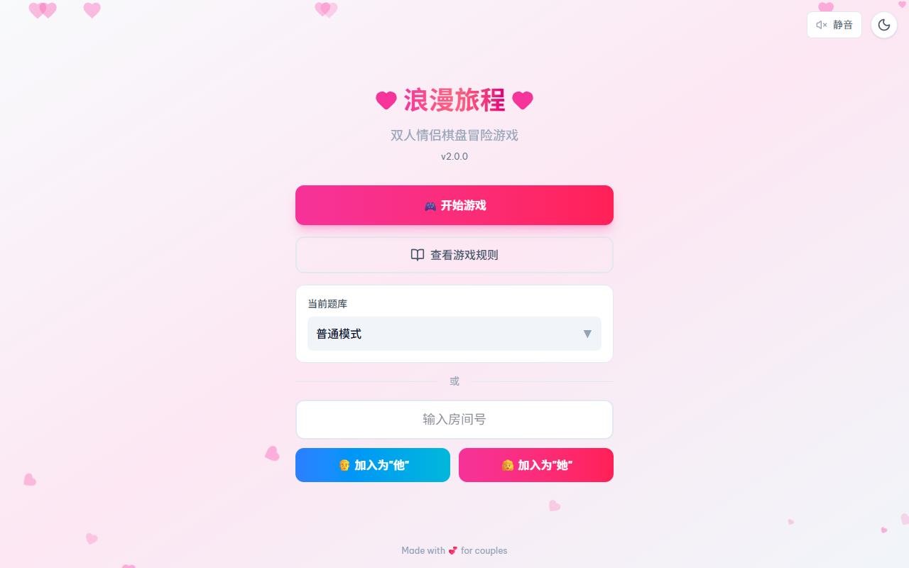
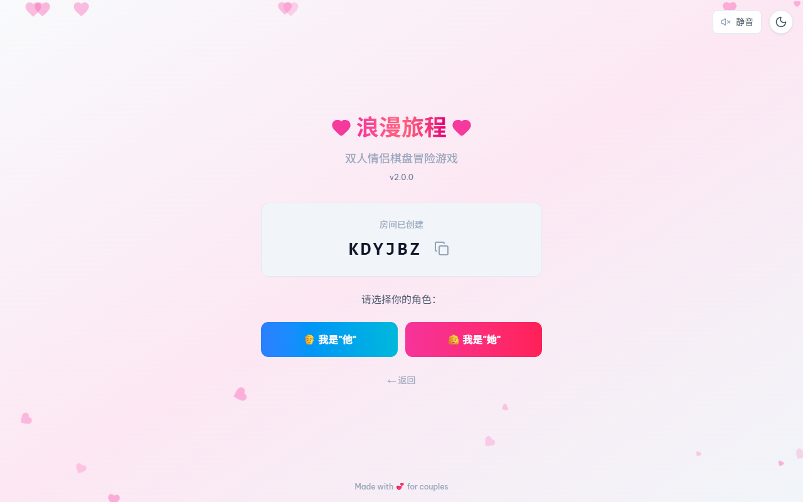
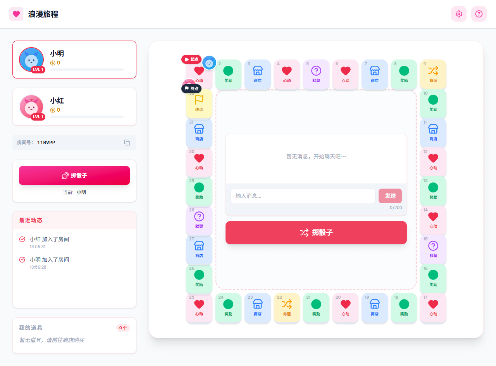
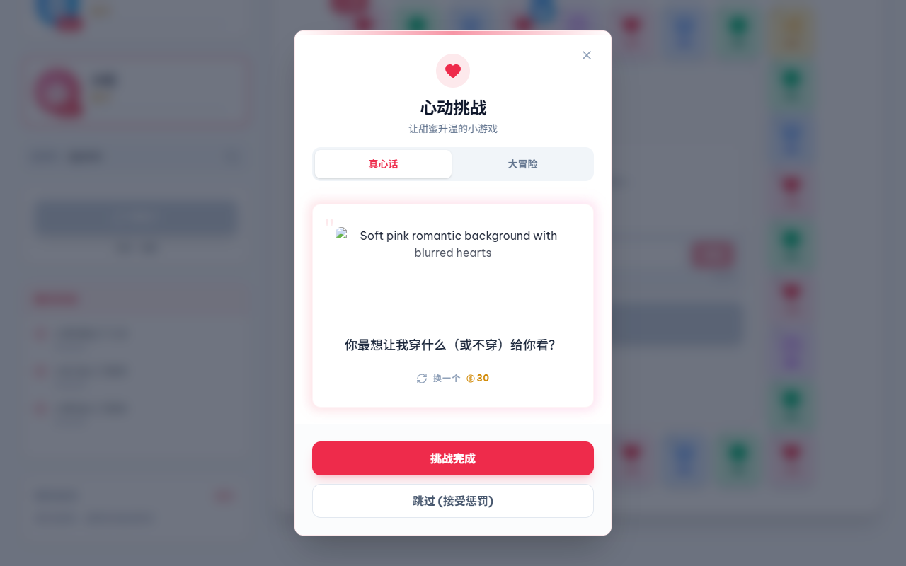
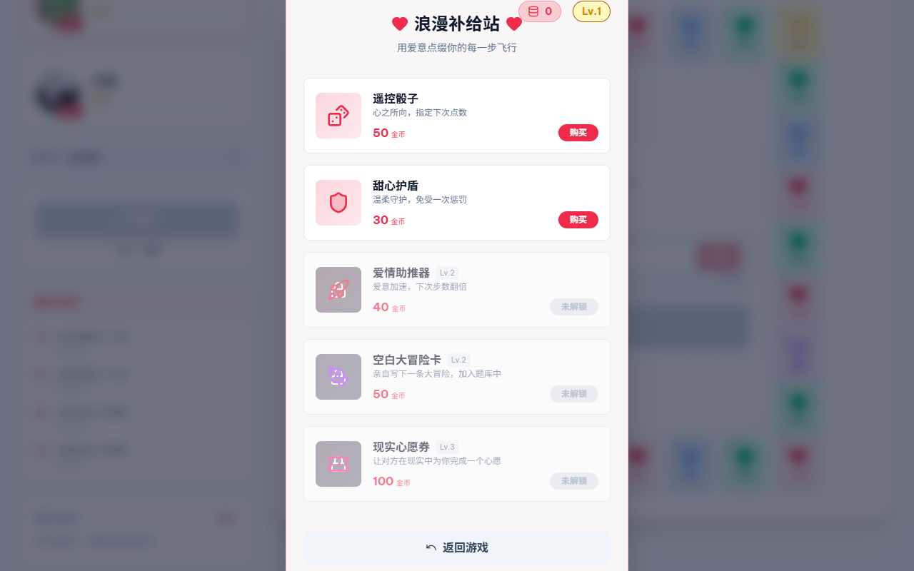
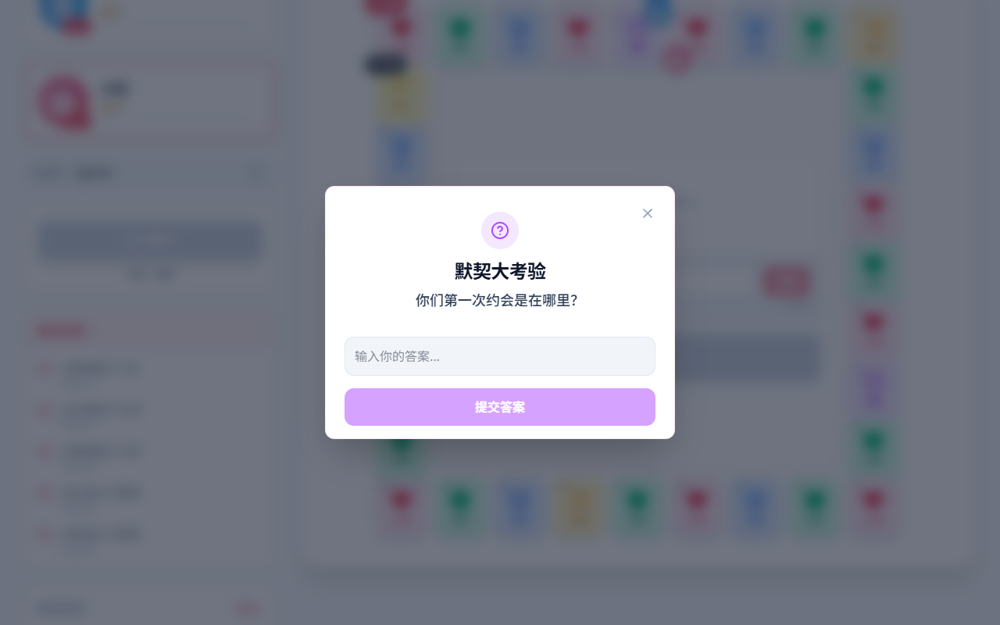

# 浪漫旅程 ❤️

双人情侣棋盘冒险游戏 —— 在线的真心话大冒险，增进情侣之间的感情。

两人创建/加入同一个房间，轮流掷骰子在 32 格棋盘上前进，触发心动挑战、命运事件、商店、默契问答等格子，边玩边升级、攒金币、买道具，一起完成一段浪漫旅程。

## 截图

### 开始界面
选择题库（普通 / SM / 异地恋 / 自定义），创建房间或加入已有房间。



### 创建房间
创建房间后获得房间号，分享给对方，分别选择"他"或"她"的身份加入。



### 游戏主界面
棋盘、双方状态（金币/经验/等级）、实时聊天和掷骰子按钮，所有操作双方实时同步。



### 心动挑战
落在"心动"格触发真心话 / 大冒险，可使用"甜心护盾"免受惩罚，也可花金币换一题。



### 浪漫补给站（商店）
用金币购买遥控骰子、甜心护盾、爱情助推器、空白大冒险卡、现实心愿券等道具。



### 默契大考验
落在"默契"格，双方分别回答同一个问题，看看默契程度，答案一致可共同获得金币奖励。



## 功能特色

- 🎮 **实时双人游戏** - 基于 WebSocket 的实时同步，断线重连、状态自动恢复
- 🎲 **趣味棋盘** - 32 格棋盘，掷骰子前进，触发心动 / 奖励 / 商店 / 默契 / 命运等多种格子
- 💕 **真心话大冒险** - 多种题库模式（普通 / SM / 异地恋 / 自定义），共 3 个等级难度
- 🛒 **道具商店** - 遥控骰子、甜心护盾、爱情助推器、空白大冒险卡、现实心愿券等道具
- ✨ **等级系统** - 经验值、升级解锁更高级题目和道具
- 🎭 **命运与特殊事件** - 随机触发的位置互换、金币翻倍、传送、禁足令等惊喜与挑战
- 💬 **实时聊天** - 棋盘旁的聊天面板，边玩边聊
- 🎨 **主题切换** - 明暗双主题，多种配色
- 🎵 **背景音乐** - 浪漫背景音乐，可一键静音
- 🤖 **AI生成题目** - 支持 DeepSeek、Kimi 等 AI 模型，根据关键词生成自定义题库

## 快速开始

### 环境要求

- Node.js 18+

### 安装

```bash
git clone https://github.com/WilderNoTrack/Romantic-Journey-Couple-Board-Game-.git
cd romantic-journey
npm install
```

### 运行

```bash
npm run dev
```

访问 http://localhost:3000

### 生产构建

```bash
npm run build
npm start
```

## 技术栈

- **前端**: React 19 + TypeScript + TailwindCSS + Vite
- **后端**: Express + Socket.IO
- **AI**: 支持 DeepSeek、GLM、Qwen、Kimi、MiniMax

## License

[MIT](LICENSE)

---

Made with 💕 for couples
